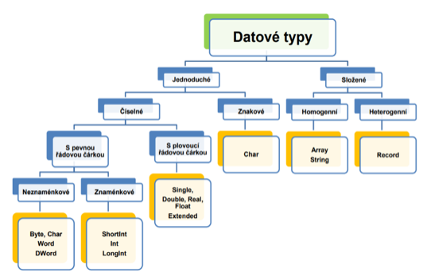

# Jazyk C: Jednoduché datové typy, reprezentace signed a unsigned, dvojkový doplněk, floating point

Jednoduché datové typy se rozdělují na **číselné** a **znakové**. Číselné se dále dělí na datové typy **s pevnou řádovou čárkou** a **s plovoucí řádovou čárkou**. Datové typy s pevnou řádovou čárkou lze následně rozdělit na **znaménkové** a **neznaménkové**.

## Neznaménkové

Rozsah čísla může být od 0 do maxima, např. pro 8 bitů: 0 až 255.

Druhy celočíselných neznaménkových datových typů:
- 8b – unsigned char, %c/%hhu
- 16b – unsigned short int, %hu
- 16b – unsigned int, %u
- 32b – unsigned long int, %lu
- 64b – unsigned long long int, %llu

Hodnota se určuje pomocí:

### Váhovový kód
Každý bit má svou váhu (hodnotu), která odpovídá mocnině čísla 2 podle pozice bitu. Bit na pozici (počítáno od nuly zprava) má váhu . Hodnota celého čísla se určí jako součet vah všech bitů nastavených na 1.

### BCD kódování
Váhový kód pro každou čtveřici bitů.

### Fixed point
Pozice řádové čárky (desetinné tečky) je pevně daná, to znamená, že není uložena v samotném čísle (na rozdíl od floating point). Číslo je reprezentováno jako celé binární číslo, ale interpretace je rozdělena na celou a desetinou část podle předem určeného počtu bitů.

## Znaménkové

Rozsah čísla je posunutý, např. pro 8 bitů: -128 až +127.

Druhy celočíselných znaménkových datových typů:
- 8b – signed char, %c/hhi
- 16b – signed short int, %hi
- 16b – signed int, %i/d
- 32b – signed long int, %li
- 64b – signed long long int, %lli

Existují tři základní způsoby kódování záporných čísel, které předpokládají zvolení konkrétní velikosti paměťové buňky (např. 8 bitů):

### Vyhrazený bit (tzv. znaménkový – signum)

Jeden bit v buňce vyhradíme a dáme mu význam znaménka. Pro hodnotu čísla zbude menší počet bitů. Je nutné zvolit, který bit bude mít význam znaménka a jaká jeho hodnota bude mít význam mínus.

**Výhoda**: Snadno se kóduje i dekóduje. Okamžitě vidíme, zda je číslo kladné nebo záporné.

**Nevýhoda**: Nula je reprezentována dvěma kódy (nevyužívá všechny stavy systému). Není vhodné pro počítání.

### Přičtení konstanty (offset)

Zvolíme si konstantu K, kterou přičteme k hodnotě čísla (pro kladná i záporná čísla). Do paměti pak ukládáme takto upravenou hodnotu. Při dekódování naopak hodnotu K odečteme. Hodnotu K lze zvolit libovolně, obvykle se volí jako polovina kapacity soustavy. Jestli je číslo záporné lze snadno rozlišit pouze pokud je konstanta K volena jako polovina kapacity soustavy.

**Výhoda**: Využívá plný počet stavů systému. Vhodnou volbou konstanty K lze pokrýt i nesymetrii.

**Nevýhoda**: Není vhodné pro počítání, jelikož v sobě zahrnuje konstantu K.

### Dvojkový doplněk

Dvojkovým doplňkem rozumíme rozdíl kapacity soustavy a absolutní hodnoty čísla. Do paměti počítače ukládáme u kladných čísel jejich hodnotu přímo, u záporných pak jejich dvojkový doplněk. Řeší problém dvou reprezentací nul a při sčítání nevyžaduje speciální hardware (stačí prostá sčítačka), ale nastává problém v rozsahu (overflow), kdy se sečtou dvě čísla, jejichž výsledek je větší, než daný rozsah dovoluje, a proto se musí nastavit správný počet bitů pro rozsah, aby k přetečení nedocházelo. Nastavení správného rozsahu pro sčítání je jeho zvětšení o jeden bit oproti počtu bitů toho většího čísla, které chceme sčítat. U násobení se správný počet bitů rozsahu nastavuje jako součet bitů čísel, které chceme mezi sebou vynásobit a správný výsledek je zaručen pomocí aritmetického posuvu. Dvojkový doplněk lze dle své definice zapsat jako $2^n - |x|$ a postup kódování je následující:

- Převedeme absolutní hodnotu čísla do binární soustavy a doplníme na požadovaný počet míst. 
- Provedeme negaci všech bitů. 
- Přičteme binárně hodnotu 1.

**Výhoda**: Využívá plný počet stavů systému. Okamžitě vidíme, zda číslo je kladné nebo záporné. Lze také přímo sčítat a odečítat.

**Nevýhoda**: Je složitější na kódování a dekódování.

## Převod čísel s řádovou čárkou do binární soustavy

Rozdělíme si číslo na celou a desetinnou část. Celou část převedeme standardním způsobem. Desetinnou část převedeme analogicky, pouze místo dělení dvěma použijeme násobení dvěma a místo zbytku po dělení opisujeme jako výsledek celou část. Výsledné číslo v binární soustavě získáme složením celé a desetinné části.

### Konstrukce datové proměnné typu Single

1. Vyjádřete absolutní hodnotu daného čísla X v binární soustavě (odděleně převeďte celou a desetinnou část).

2. Vytvořte normalizovaný tvar: Řádovou tečku posuňte za první jedničku zleva, počet posunutí určí hodnotu EXPONENTU:
      - Žádný posun => e = 0
      - Posun vpravo => e < 0
      - Posun vlevo => e > 0

3. Určete obsah pole S:
      - X >=0 => S=0
      - X < 0 => S=1

4. Určete obsah pole E: Vyjádřete hodnotu e+127 binárním váhovým kódováním (jako typ Byte)

5. Určete obsah pole M: Jsou to bity, které zůstaly po posunutí řádové tečky vpravo od ní.

Získání hodnoty reálného čísla z datového typu Single se provádí opačným postupem nebo dosazením do vzorce:

$(-1)^S \cdot 2^{E-127} \cdot (1,M)$

Popsaný způsob kódování má své limity – například není možné vyjádřit hodnotu nula nebo nekonečno. Proto jsou zavedeny následující výjimky:
- Pokud S = 0, E = 0 a M = 0 : hodnota čísla je nula
- Pokud e = -127 : exponent se bere jako –126 a absolutní hodnota nemá tvar (1,M), ale (0,M)
- Pokud e = 128 : hodnota čísla je nekonečno, M musí být 0. Jiné hodnoty M jsou neplatné

Problém nastává také při sčítání velmi velkého a velmi malého čísla, kde v důsledku zaokrouhlovacích chyb dochází k zanedbání čísla s malou hodnotou. 