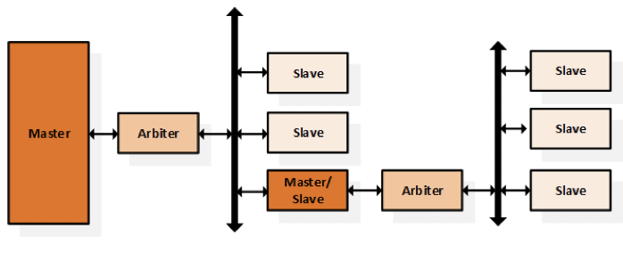

# Klasifikace sběrnic v embedded systémech, pojmy master, slave, arbiter, transakce, burst, teoretická a reálná bandwidth, topologie

## Sběrnice 

Prostředek pro doručení informací

- Paralelní – zvlášť kanál pro adresu, data, řízení – dnes více rozšíření (AMBA, Avalon)
- Sériové – adresa, data, řízení – jeden kanál
- Klasifikace periferií – věcí, co mají přístup na sběrnici
    - Arbiter – monitoruje sběrnici přiděluje roli master (pevná priorita, dynamicky)
    - Master – Může iniciovat transakci
    - Slave – může odpovědět na transakci
    - 
Transakce – „jednotka“ na sběrnici (jeden celý cyklus – adresování, handshake,  přesun dat)
- Požadavek mastera(chce vysílat) -> arbitrace(přidělení priority)->přenos

- Burst transakce – více v otázce 21 (z jiného pohledu)
    - Normální komunikace – přečtou se data z 1 adresy, nebo se na ni zapíšou
    - Burst mod – Čtení/zápis z/na vzestupný rozsah adres (zadaná poč. adr.) 
- Parametry sběrnice 
    - Datová šířka (D) – počet bitů přenesený / 1 cyklus
    - Adresní šířka – (4 bity – dokáže oslovit 1 z 16 cílů)
    - Frekvence sběrnice Fs
    - Teoretická propustnost – max počet BAJTŮ/s      Fs*D
    - Reálná propustnost =  FS*D – režie(obsluha sběrnice – adresy atd.)
- Topologie
    - Peer to peer – Rovnocenná zařízení
    - Sběrnice – odbočky do jednotlivých uzlů
    - Crossbar – Více variant propojení (analogie – propojovací matice FPGA)

