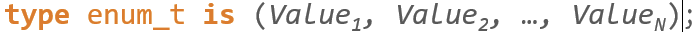
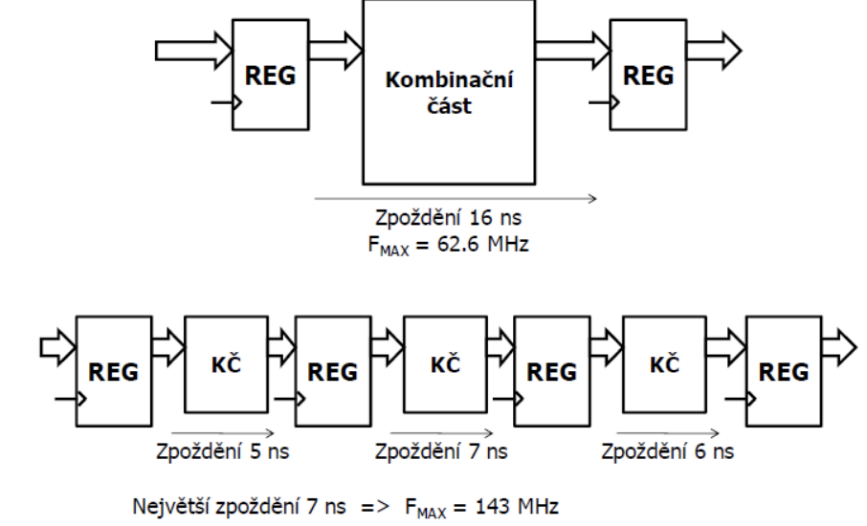
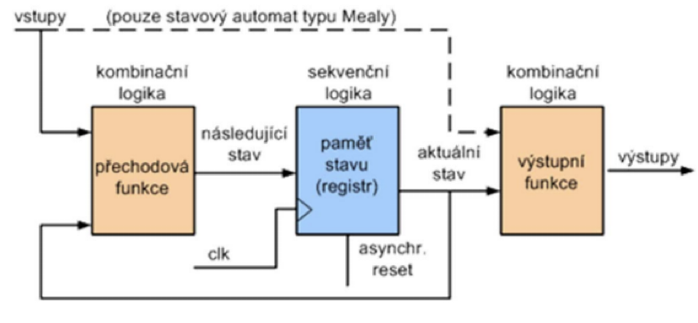

# VHDL - základní datové typy, knihovní typy, VHDL pro syntézu - způsoby efektivního popisu paměťových, aritmetických a řídících obvodů

## Základní datové typy

Určuje formát dat, který může daný port, signál, proměnná či konstanta přenášet nebo s nimi pracovat.

### Číselné (numerické)

- Integrer – celočíselný   (-10)
- Natural <0, integer’max>   (5)
- Positive <1, integer’max>    (5)
- Real – nesyntetizovatelné    (10.1)

- Od základní numerických lze odvozovat vlastní datové typy – příkaz TYPE
    - S kódováním definovaným rozsahem 
    - S kódováním definovaným typem 
    - Výčtový typ (př. Std_logic) 

### Logické (výčtové)

- Bit – ‘0‘,‘1‘
- boolean – true, false

### Znakové(výčtové)

character, string

### Fyzikální

time (10 ns)

Signed a Unsigned – chápány jako čísla ve 2 soustavě, pro práci s aritm. operátory

## Složené datové typy

Více elementů v jednom objektu 

### Pole 
- Homogenní (jsou v něm prvky se stejným datovým typem)
- Indexování (), deklarace příkazem RANGE
- Speciální případ – std_logic_vector

### Záznam (record)
- Heterogenní
- Výběr pomocí tečky

### Interface(VHDL 2019)
- Deklarace jako port, přidává view (deklarace směru toku signálu)
- Nutné alespoň 2 view (Master a Slave)

## Operátory

Logické (and, or, nand, nor, xor, xnor, not)  
Relační (=, /=, <, >, =>, >=)  
posuv a rotace (sll, srl, sla, sra, rol, ror)  
aritmetické(+, -, *, /, mod(modulus), rem(remainder),abs(abs hodnota),**(exponent))  
slučování(&)

## Datové objekty

- Konstanty – nemění se, deklarace v entitě, architektuře, procesu, funkci, proceduře
- Proměnné – pomocné, nelze deklarovat v entitě a arch. – nelze použít pro porty
- Signály/porty – fyzicky přítomné, deklarace pouze na začátku architektury/entity

Datový objekt deklarovaný:
- v procesu - viditelný pouze uvnitř tohoto procesu;
- v architektuře - viditelný ve všech příkazech této architektury;
- v entitě - viditelný ve všech architekturách přidělených této entitě;
- v „package“ je viditelný ve všech návrzích užívajících tohoto „package“.

## Atributy

speciální funkce, kde jsou informace jejich nositelích(typy,signály,proměnné,pole..)

## VHDL pro syntézu

Původní záměr VHDL je pro simulaci ≠ to není stejné jako pro syntézu
- Nelze syntetizovat vše (shared variable, loop, while)
- Různá podpora v různých EDA prostředích
- VHDL pro ASIC ≠ VHDL pro FPGA

## Doporučení pro efentivní kód

Nepoužívat klíčová slova z Verilogu ve VHDL (module,reg,wire)  
Nepoužívat rezervovaná slova (CLB,CLK,GND,A4,Slice)
Stejné jméno entity a souboru. 
Nepsat zkrácené port maps (přidrátování signálů na porty – třeba při vložení komponentu), nezkracovat výrazy, používat konstanty  
Používat ideálně jedny hodiny, synchronní logiku (set a reset), std_logic_vectory  
Používat std_logic_vectory

Větvení programu
- Definice všech větví (ošetření nežádoucího stavu) –př. použití others u case
- Nepoužívat ve větvích aritmetiku – co nejjednodušší podmínky
- VHDL pro ASIC ≠ VHDL pro FPGA

Aritmetika – závorkovat, povolit sdílení zdrojů(menší množství logiky, nutné nižší clk)  
Používat Pipelining – aby byly validní data včas na svém místě, umožnuje zvýšit hodiny. 

Zapnout retiming(synch.) registrů

Používat registry v místě potřeby  
Část LUT lze využít jako posuv reg.

Synchronní návrh
- Na clk vstupy prvků je přiveden pouze clk, bez přídavné logiky
- Používat jen FF (hranové k.o.)
- Nepoužívat zpětné vazby na kombinační logice
- Potenciálně asynchronní signály synchronizovat – synchronizátory – D k.o.
    - Přechod mezi časovými doménami, možná nekoherence dat, krátké pulzy v signálu

Paměti – co lze na jejich realizaci využít
- Registry - nejrychlejší, ale málý počet
- Distribuovaná paměť (LUT – malé FIFO) - menší paměti – přímo v místě potřeby – rychlejší ale je náročnější na propojovací sítě.
- Bloková RAM - speciální, paměťové bloky v FPGA, snadno konfigurovatelné a efektivní z hlediska nároků na plochu čipu
- Lze je vytvářet
    - Z kodu pomocí syntézy
    - Pomocí maker (XPM – knihovna s pamětma)
    - Pomocí IP - nepřenositelné

Stavové automaty – co lze na jejich realizaci využít
- Používání stavových proměnných typu enumerated (přehledné)
- Nepoužívat u dataflow(současné příkazy) 
- Ošetřit nevyužité stavy – nárůst logiky
- Realizace pomocí 1,2,nebo3 procesů (paměť, přechodová fce, výstupní fce)
- Lepší použít MOORE (Mealy má složitější přechodovou fci a výstup závisí i na vstupu – špatně predikovatelné)

