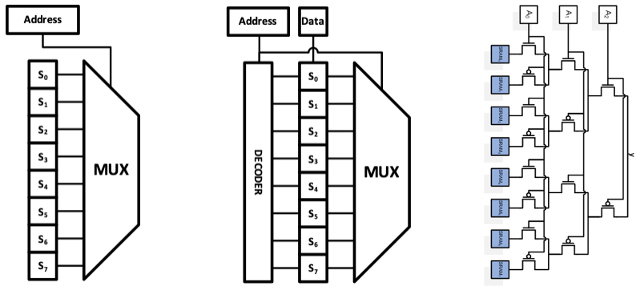
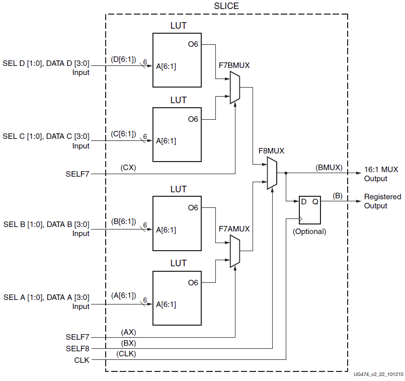

# FPGA: Struktura a přehled zdrojů SLICE, vytváření multiplexorů a režimy LUT

## FPGA (Field Programmable Gate Array)

FPGA je pole konfigurovatelných logických bloků propojených programovatelnými spoji. Návrh logiky se po syntéze a mapování zapíše do konfigurace, která „překabeluje“ spojení a nastavení zdrojů uvnitř čipu. Základní stavební jednotku tvoří CLB (Configurable Logic Block), jenž se skládá z dvojice SLICE, přičemž každý SLICE obsahuje kombinaci LUTů, registrů pro sekvenční logiku, MUXů a rychlých řetězců pro aritmetiku. Tato organizace umožňuje efektivní realizaci kombinátorické i sekvenční logiky, multiplexorů a aritmetických operací přímo v textu HDL, které nástroje pak namapují na konkrétní zdroje SLICE. Zdroje uvnitř SLICE nejsou náhodné, jsou pevně dané křemíkem, ale my je konfigurací měníme na to, co potřebujeme (čítač, hradlo, paměť)

## Struktura SLICE a jeho zdrojů

Uvnitř každého SLICE najdeme čtyři hlavní typy prostředků:

- **Look-Up Tables (LUT)**:  Využívá se čtyř LUTů se šesti vstupy. LUT funguje jako pravdivostní tabulka: pro vstupů uchovává konfiguračních bitů a podle aktuálních hodnot vstupů vybere jeden bit jako výstup. Prakticky je proto LUT ekvivalentem  multiplexoru, kde „datové“ vstupy tvoří konfigurační paměť LUT a „adresu“ představují logické vstupy uživatelského obvodu. Obsah LUT se nastavuje při konfiguraci FPGA a následně se čte asynchronně během běhu. Tato implementace umožňuje v jedné LUT6 realizovat širokou škálu booleovských funkcí bez potřeby hradlové sítě, jinými slovy to, co se dá popsat logickou funkcí o 6 proměnných, se vejde do jedné jediné LUT. Jedná se tedy o základní prvek pro kombinatorickou logiku (realizace funkcí přes paměťovou tabulku).
- **Klopné obvody (Flip-Flops)**: Za každým LUTem následují paměťové prvky. Obvykle je jich v jednom SLICE osm (dva pro každý LUT). Využívají se klopné obvody typu D a slouží k uchování stavu, tedy k vytváření sekvenční logiky (registry, čítače, stavové automaty). Princip jejich činnosti je takový, že při příchodu hodinového impulsu se na výstup přenese hodnota vstupu a zůstává tam, dokud nepřijde další hodinový impuls. Jedná se tedy o základní prvek pro sekvenční logiku (uchování stavu pomocí klopného obvodu).
- **Multiplexory (Wide Muxes)**: Kromě LUT jsou zde i specializované hardwarové multiplexory (F7AMUX, F7BMUX, F8MUX). Ty slouží k tomu, aby se výstupy z více LUTů daly spojit dohromady a vytvořily složitější logické funkce.
- **Řetězec pro přenos (Carry Logic)**: Jedná se o vyhrazenou hardwarovou cestu pro rychlou aritmetiku. Jde o podporu při sčítání a odečítání, jelikož přenos (carry) z jednoho bitu do druhého by za normálních okolností šel přes lokální routing LUTu, což je ale velice pomalé. Proto se využívá vyhrazená cesta, která je daleko rychlejší. Díky tomu jsou FPGA efektivní v matematických operacích. Tato cesta vede v každém sloupci SLICE a má lineární zpoždění dle své délky.

Existují dva typy SLICE:

- **SLICEL (Logic)**: Obsahuje pouze logiku. Umí jen kombinační funkce a aritmetiku.
- **SLICEM (Memory)**: Je "chytřejší". Jeho LUTy dokáží fungovat i jako distribuovaná paměť (RAM) nebo posuvné registry (Shift Registers).

## Vytváření multiplexorů

Multiplexor je obvod, který vybírá jeden z mnoha vstupů a posílá ho na výstup. V FPGA se multiplexory vytvářejí několika způsoby podle toho, jak jsou velké (kolik mají vstupů):
- **Malé multiplexory (do 4:1)**: Ty se realizují uvnitř jedné LUT. Protože 6-vstupová LUT má dostatek vstupů (adres), dokáže se chovat jako multiplexor 4:1. Dva adresní vstupy LUT slouží jako výběrové signály (Select) a zbylé čtyři vstupy jako data.
- **Střední multiplexory (8:1 a 16:1)**: Zde už jedna LUT nestačí. Musíme spojit výstupy z více LUTů dohromady. K tomu FPGA používá zmíněné vyhrazené zdroje ve SLICE – F7 A(B) a F8 MUXy.
    - MUX 8:1: Spojí se dva LUTy (každý řeší část) a jejich výstup se spojí s F7A(B)MUX. To se děje v rámci jednoho SLICE.
    - MUX 16:1: Spojí se čtyři LUTy, projdou přes dva F7A(B)MUXy a výsledek se spojí v F8MUX. I toto se vejde do jednoho SLICE.
- **Velké multiplexory (32:1 a více)**: Ty už se nevejdou do jednoho SLICE. Musí se propojit více SLICE dohromady. Pro tyto velké multiplexory může FPGA využít i Carry Logic (řetězec pro přenos), který se dá "zneužít" pro výběr signálu, protože je velmi rychlý a propojuje SLICE vertikálně pod sebou.

## Režimy LUT

V závislosti na tom, zda je LUT v SLICEL nebo SLICEM, může pracovat v různých režimech:

1. **Generátorický režim** LUTu využívá skutečnost, že LUT je malá paměť, kterou lze naprogramovat libovolnými hodnotami, a pokud se její vstupy řídí například čítačem nebo posuvným registrem, začne na výstupu postupně generovat předem definovanou sekvenci, tím se z ní stává zdroj signálu. V praxi tak LUT může fungovat jako generátor konstantních hodnot, periodických průběhů (např. sinusová tabulka pro DSP), pseudonáhodných sekvencí nebo jako malá ROM, a díky tomu se uplatňuje při tvorbě modulací, filtrů či jednoduchých paměťových struktur přímo uvnitř FPGA.
2. **Logický režim (ROM)**: Toto je základní režim dostupný ve všech SLICE. LUT funguje jako paměť ROM (Read-Only Memory). My do ní při konfiguraci FPGA zapíšeme pravdivostní tabulku (nuly a jedničky). Vstupy LUT pak fungují jako adresa, která vybere konkrétní nulu nebo jedničku na výstup. Tím se realizuje jakákoliv kombinační logika (AND, OR, XOR atd.).
3. **Režim distribuované paměti (Distributed RAM)**: Tento režim je dostupný pouze ve SLICEM. Zde se LUT chová jako malá RAM paměť, do které můžeme za běhu zapisovat data (Write Enable, Data In, Address). Můžeme tak vytvořit malou, velmi rychlou paměť přímo v logice, aniž bychom museli používat velké blokové paměti (Block RAM).
4. **Režim posuvného registru (SRL - Shift Register LUT)**: Opět dostupné pouze ve SLICEM. V tomto režimu se vnitřní paměťové buňky LUT propojí do kaskády. S každým hodinovým taktem se data posunou o jednu buňku dál. To je extrémně výhodné pro vytváření zpoždění (delay lines). Místo toho, abychom spotřebovali 32 klopných obvodů pro 32-bitové zpoždění, použijeme pouze jednu LUT v režimu SRL32. To šetří obrovské množství místa na čipu.

### Scháma LUTu

### Schéma SLICE

### Schéma Shift Register

### Schéma Carry Logic

