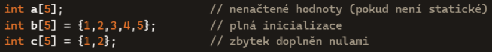

# Jazyk C: Pole, vícerozměrná pole, ukazatele, generický ukazatel, řetězce

## Pole
Pole patří do skupiny **složených homogenních** datových typů a jedná se o datovou strukturu, která obsahuje pevný počet prvků libovolného, ale jednotného datového typu (kromě „void“). Tyto prvky jsou v paměti uloženy sekvenčně (za sebou) v souvislém bloku. Velikost není hlídaná, tudíž je při práci s polem nutné hlídat hranice, jelikož čtení mimo rozsah pole je nedefinované chování a častá příčina chyb. Velikost pole uvádíme při jeho deklaraci do hranatých závorek a v jazyce C se vždy indexuje od 0 do N-1.

## Vícerozměrné pole
Vícerozměrné pole je pole, jehož prvky jsou opět pole, to znamená, že například dvourozměrné pole

představuje matici o dvou řádcích a třech sloupcích, uloženou v paměti souvisle po řádcích (tzv. rowmajor order). Přístup k prvku probíhá pomocí více indexů, například

Pole může být i vícerozměrné, například třírozměrné, které tvoří 2 bloky a každý obsahuje 3 řádky po 4 prvcích.

## Ukazatel

Ukazatel je proměnná, která neuchovává přímo hodnotu, ale adresu v paměti, kde je hodnota příslušného datového typu uložena (zosobňuje adresaci druhého řádu v ISA). Ukazatele jsou klíčové pro efektivní práci s pamětí, předávání velkých struktur bez kopírování, dynamickou alokaci a práci s poli.

Používají se dva operátory:
- Referenční operátor „&“ získá adresu proměnné ("kde to je?")
- Dereferenční operátor „*“ získá hodnotu na dané adrese ("co tam je?")

Hodnoty ukazatelů nemohou být libovolně přiřazovány, tudíž se musí případně přetypovat.

Název pole se ve většině výrazů chová jako konstantní ukazatel na první prvek pole, to znamená, že „pole“ je ekvivalentní s „&pole[0]“ a pro přístup k „pole[i]“ překladač interně přepíše na aritmetiku ukazatelů „*(pole + i)“. Hlavními rozdíly mezi polem a ukazatelem je, že ukazatel je proměnná a můžeme u něj změnit to, kam ukazuje, zatímco název pole je konstantní adresa, která je pevně dána (rezervována) v paměti a změnit ji nemůžeme. Další rozdíl je ve velikosti. U pole „sizeof(pole)“ vrátí celkovou velikost pole v bytech, zatímco u ukazatele „sizeof(ukazatel)“ vrátí velikost adresy (obvykle 4 nebo 8 bytů), bez ohledu na to, jak velký blok dat za ní leží.

Hodnota ukazatele „NULL“ představuje speciální konstantu, která označuje, že ukazatel neukazuje na žádný platný objekt ani adresu v paměti. Je to tedy „nulová“ adresa, používaná jako bezpečný způsob, jak vyjádřit, že ukazatel je prázdný nebo neinicializovaný.

## Generický ukazatel

Generický ukazatel je ukazatel typu „void*“, který může uchovávat adresu libovolného objektu bez informace o konkrétním datovém typu. V jazycích odvozených od C se klíčové slovo „void“ používá k vyjádření absence typu, u funkcí znamená „nevrací hodnotu“, u parametrů „žádné parametry“, a jako „void*“ označuje obecný (typově neinformovaný) ukazatel. Generický ukazatel nelze dereferencovat přímo, jelikož se neví, kolik bytů má z dané adresy přečíst (zda je to „int“, „char“ nebo „double“), také nelze provádět aritmetiku, protože se neví, o kolik se má adresa posunout. Proto se před použitím musí přetypovat na konkrétní typ. Díky své neutralitě se běžně používá pro alokace paměti, kopírování bloků nebo třídění s callbackem, kde typová informace je známá až volajícímu.

## Řetězec
Řetězec je zde definován jako pole znaků typu „char“ uložené v souvislém bloku paměti, které je vždy ukončeno speciálním nulovým znakem '\0'. Tento ukončovací znak umožňuje funkcím ze standardní knihovny (např. strlen, printf("%s"), strcpy) zjistit, kde řetězec končí, protože samotné pole neuchovává informaci o své délce. Řetězec může být vytvořen jako literál ("Hello"), pole znaků (char s[] = "Hello";) nebo ukazatel na konstantní paměť (char *p = "Hello";), přičemž je nutné vždy zajistit dostatek místa pro všechny znaky včetně ukončovací nuly. Pro práci s řetězcem platí stejná pravidla jako pro práci s polem.

