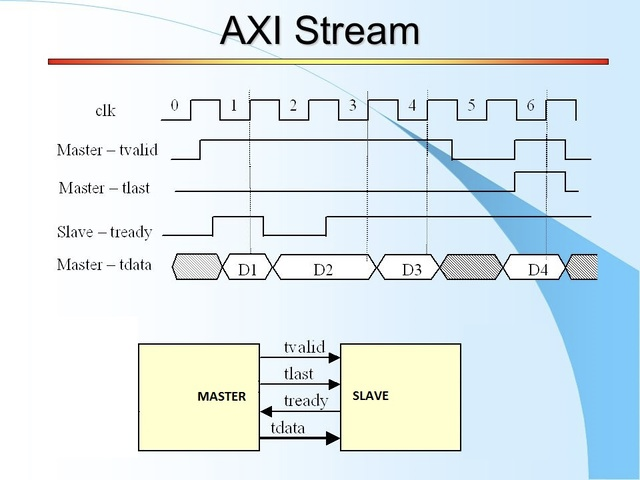

# Model Composer – Výhody a nevýhody oproti popisu HDL/HLS, bloky Gateway in, základní aritmetické bloky, podpora AXI stream

## Model composter

- Nástroj pod MATLAB určený pro návrh HW
- Umožňuje – návrh HW, IP jader, HW co-simulation
- Je třeba mít : MATLAB a Simulink, Vitis + Vivado+Model Composer
- Při použití starších technik (nízkoúrovňový návrh HDL, příp. grafický) je nutné všemu (číslicová elektronika) rozumět a znát do detailů
- Vznikl jako snaha pomoci programátorovi 
    - vysokoúrovňová syntéza (vyšší abstrakce) – převod z prog, jazyka na HDL
    - Alternativy Model C. - (vysokoúrovňový grafický návrh) – LabView, HDL Coder
        - Dají se dosáhnout dobré výsledky, programátor musí chápat HW 
        - Při použití správných knihoven – značné zkrácení vývoj. cyklu

## AMD toolbox

spousta připravených bločků

- HDL – návrh přímo syntetizovatelných (udělatelných) primitiv
    - Hradla, registry, aritmetika, paměti
    - FIR, FFT
- HLS – Blokový návrh pomocí vysokoúrovňové syntézy
    - Nepracuje se zde se signály, ale s maticemi, buffery
- VITIS MODEL COMPOSER HUB
    - Bloček umožňující propojení s Vitis 
        - Výběr FPGA, Vývojové desky,co-sim platformy
        - Nastavení – VHDL/Verilog, HDL/IP jádro,nastavení hodin…

## Výhody oproti HLS 
(Vysokoúrovňová syntéza)/HDL(Hardware description language)

- Grafická reprezentace – Přehledné,vyšší míra abstrakce než  C kód/HDL
- Možnost použití Ekosystému Simulink, MATLAB – mrda knihoven
- Rychlejší ladění a simulace (v simulinku prostě připojíš drát) HLS/ - ručně
    - Do simulinku jde dát jako vstup i posranej obrázek.
- **Automatická generace rozhraní(AXI4 a handshake signály)** HLS – ručně

## Nevýhody oproti HLS /HDL
- Cena
- Menší kontrola nad detaily (simulink má nastavení ale někdy to je v C lepší)
    - Zkušený HDL programátor zabere méňe zdrojů než model composer
- „Black Box efekt“ – je těžký zjistit, proč vygenerovaný blok zabírá více zdrojů
    - V Cčku to jde vidět – dá se to dohledat
- Kompatibilita – více nutných softwarů – nutno sladit verze – upgrade všeho
- Nepřehledné/neefektivní pro stavové automaty a složitější větvení

## Základní bloky
### Gateway IN, Gateway OUT
- V rámci simulinku jsou 2 prostory – 1s v simulinku = 1 takt clk v Model Com.
    - SW prostor – Matlab (spojitý,double)
    - HW prostor – Model Composer (diskrétní, synchronní, uživatelské datové typy)
- Gateway bloky provádí konverzi mezi těmito prostory
- Gateway IN bloky – ADC (s nastavením Ts a kvantizace), IN pin, AXi registr
- Gateway OUT bloky – DAC, OUT pin, AXI lite registr

### Aritmetické, logické bloky, routování
- Aritmetické – Absolute, Exponential,AssSub,Mult,Divide
- Logické – expression,relational,inverter,logical 
- Routování – serial to parallel, parallel to serial

### Sekvenční bloky
- Delay,Register
- Rom, single port RAM, dual port RAM, FIFO, AXI FIFO
- LFSR (linear feedback shift register), Counter

### Speciální bloky
- Convert – konverze signálu na jiný datový typ, změna počtu bitů
- Reinterpret – přetypování signálu na jiný datový typ, bez změny počtu bitů
- Assert 
- Bitová manipulace – Slice(řez vektoru),Concat(sloučení &),Bitbasher

- **Mcode** – spouštění uživatelských matlab funkcí – pár řádků kódu je někdy přehlednější, než grafická interpretace, ale musí se dávat hodně pozor
    - Matlab funkce musí být realizovatelná jako HW
    - If, else, else if – deterministické podm. – hodnoty case musí být známe v době kompilace – case (x) – x nesmí být měnící se vstup, ošetření všech stavů
    - Dělení -  pro dva signály- HW složité, těžká syntéza, lze násobit převrácenou hodnotou 
    - Dělení mocnonou 2 – mcode to interpretuje jako bitový posun
    - Relační operátory (<,> ==) – třeba hlídat datové typy
    - Lze použít pro sekvenční obvody – persistent proměnné uchovávají hodnotu mezi cykly

## Podpora AXI stream

- Jsou tu bloky 
    - Gateway In/Out – aut. nastavení dle kontextu (aut inference)
        - X_tdata,  - přesouvaná data
        - X_tvalid, - 1 = přenos dat, 0 = data jsou naprázdno
        - X_tready – připraveno na příjem dat
    - Případně Gateway In/Out AXIS

V rámci model composeru se dá použít bloček, kde je zapracovaná AXI4-Stream
- Jen interface bez nepovinných signálů (tlast(packet end), tuser(packet start))

### Základní flow

- Model composer
    - Sestavení schéma
    - Nastavení Ins a Outs (datové typy, adresy registrů)
    - Ověření funkce
    - Vytvoření subsystému
    - Nastavení bločku Vitis model composer hub (export jádra)
    - Vygenerování IP jádra
- Vivado
    - Import jádra -> blokové schéma -> export bitstream (konfigurace fpga)
- Vitis – tvorba ovladačů(prostředník mezi SW a HW),aplikace
    - Ovladač- kus kódu, který ví, kam sáhnout do paměti, aby se rozblikala led

