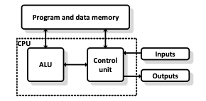

# Architektonické koncepty počítače, ISA procesoru s příklady (stack, ACC, GPR), instrukční cyklus, RISC vs CISC, současné trendy CPU

### Harvardská

Základem jsou oddělené paměti pro data a program  
Není nutné použít stejný typ paměti (různá šířka adresy a dat, časování, kapacita)  
Lze přistupovat k oběma pamětem naráz typický „Harvard“ procesor to nedělá

### Von Neumann

Základem je společná paměť pro data a program  
Univerzálnější koncepce, ale program je nutné nejprve načíst z externího média  
Pomalejší přístup, rychlost pamětí je slabým článkem, proto procesory používají CACHE (vyrovnávací)

Dnešní počítače se zvenku jeví jako V.N. ale uvnitř je Harvard (oddělené cache)

## ISA – Instruction set architecture – architektura instrukčního souboru

Obecný popis organizačních, funkčních a provozních principů procesoru  
Rozhraní mezi softwarem (programem) a hardwarem (procesorem).  
Z pohledu programátora - seznam dostupných mechanismů pro programování. (Vlastnosti výpočetního systému)  
ISA neřeší, jak procesor funguje uvnitř, ale co umí navenek – (důležité pro kompatibilitu)  
Procesory, co mají stejnou instrukční sadu, vykonávají program stejným způsobem

### ISA definuje:
- Instrukční sadu: Seznam příkazů, které procesor umí (např. SEČTI, PŘESUŇ).
- Kódování instrukcí
- Nakládání s operandy – adresování (přímé – pomalé,RAM)(nepřímé – rychlé     registry přímo u procesoru)
- Nakládání s výsledkem
- Větvení programu
    - Podmínky(flags-příznaky)
    - Volání podprogramů
    - Interupt(priorita,počet)
- Registry: Malá, super-rychlá paměť přímo v procesoru pro okamžité výpočty.
- Adresování paměti: Jakým způsobem procesor čte a zapisuje data do RAM.
    

### ISA – Střadačově orientovaná (akumulátor) acc
- Nejstarší a nejjednodušší – mechanická kalkulačka, 4004, 8051
- Procesor má jeden speciální registr – Střadač(akumulátor), další nepoužívá
    - Ten je zdrojem a cílem většiny instrukcí
    - Kvůli tomu, že je registr jeden, se musí lést hodně do paměti
    - Jeden vstup do výpočtu je ve střadači, výsledek pak tuto hodnotu přepíše
- Instrukce jsou velmi krátké – není třeba říct, kam se má výsledek uložit – do střadače

### ISA – Zásobníkově orientovaná (stack)

- Používá zásobník(LIFO) – př. JAVA virtual machine(SW), Picojava
- Zdroj a cíl všech operandů

- Je to něco mezi, horší než architektura s registry (dnešní PC), ale lepší než architektura se střadačem (staré čipy)  
- Instrukce jsou bezadresové – stačí říct, kolik hodnot z vrchu zásobníku chceš  
- Vysoká hustota kódu – efektivní pro mat operace  
- Př ADD 4 (sečti poslední 4 hodnoty stacku a výsledek ulož na vrchol stacku)

- Nemožnost náhodného přístupu – hodnota může být hluboko a čísle ve vyšších patrech je nutné někam odložit  
- Pomalé – zásobník bývá uložení v paměti (RAM, CACHE), což je pomalejší než registry

### ISA – General purpose register (GPR)

- Používá spousty registrů - x86/x64 ARM
- Zdroj a cíl všech operandů

- Často obsahuje pipeline  
- **Pipelining** - zřetězené zpracování či překrývání strojových instrukcí je způsob zvýšení výkonu procesoru Základní myšlenkou je rozdělení zpracování jedné instrukce mezi různé části procesoru a tím i umožnění zpracovávat více instrukcí najednou.

- Mnoho módů adresace – každý registr může být zdrojem i cílem operace
- Snižuje nároky na propustnost paměťového systému
- Snadná paralelizovatelnost
    - **Superskalární architektury** – více ALU
    - **Single instruction multiple data** (SIMD) sdílená paměť – Vektorové počítače - Urychlují práci tím, že vykonávají instrukce na řadě hodnot najednou (vektoru), obvykle obsahují jednu řídící jednotku a více výkonných, každá výkonná pracuje na svých datech.  
    - Př. MMX(multimedia extension),SSE(streaming simd extension), Neon
    - **Very long instruction word** - typ architektury procesoru navržený pro provádění více operací v jediném instrukčním cyklu.

## Instrukční cyklus

Všechny kroky nutné k vykonání instrukce:
- Načtení instrukce z paměti (dle čítače programu) FETCH
- Dekodování instrukce (příprava ovládání datové cesty procesoru)  DECODE
- Načtení operandů – nastavení čtení registrů   LOAD
- Vykonání instrukce EXECUTE
- Zápis do paměti, provedení IO operace MEMORY/IO
- Uložení výsledku WRITEBACK

## CISC – Complex instruction set computer

- Velký počet instrukcí, malý počet vnitřních registrů  
- Mikrokód umožňuje naprogramovat jakoukoliv instrukci  
- Složitý řadič instrukcí – stavový automat často relizovaný na ROM paměti  
- Instrukce jsou různě dlouhé – různý počet operandů, různá velikost v programové paměti, různá doba vykonání  
- Instrukční sada obsahuje i velmi složité instrukce (násobení, dělení apod.), většina operací se provádí s akumulátorem ->pomalejší zpracování instrukcí Efektivní pro komplexní instrukce, neefektivní pro jednoduché  
- Interní Frekvence = 1 / zpoždění na nejdelší kombinační cestě  
- Externí frekvence = interní frekvence / počet stupňů

## RISC – Complex instruction set computer

- Optimalizovaná sada instrukcí – jednoduché, stejně dlouhé – lze provádět efektivně  
- Komplexní isntrukce ponechány kompilátoru  
- Délka provádění trvá vždy jeden cyklus  
- Interní frekvence = externí frekvence = 1 / max(zpoždění stupně)  
- Řadič instrukcí je distribuován mezi jednotlivé stupně  
- Pracuje se s registry – odpadá práce s akumulátorem  

- Reálně : pro sečtení dvou čísel je musím nejdříve načíst – mezi tím STALL (čekání)

- STALL musí být odstraněn
    - CACHE – rychlá paměť v místě potřeby
    - Superskalarita – přidání více ALU – paralelní zpracování
