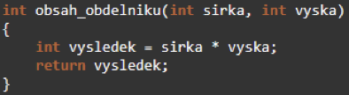
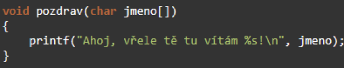

# Jazyk C: Operátory, funkce, návratové hodnoty, zásobník, ukazatele na funkce, standartní knihovny, direktivy

### Operátory

Operátory provádějí nějakou operaci mezi operandy, tato operace může být matematická, logická nebo bitová. Lze je rozdělit podle počtu operandů na unární (1 operand), binární (2 operandy) a ternární (3 operandy). Dále se dělí na aritmetické, logické, bitové, relační, přiřazovací. Mají priority, když nevíš, závorkuj.

Příklady:
- Unární:
  - přetypování z int třeba na char  
  int A = - 700; printf("%d", (char)A); // prints 68!
  - Velikost prvku v bajtech: sizeof(); Unární plus a mínus: +4 = 4, -4 = (-1*)4
  - Logická negace: !, bitová negace: ~; Operátor inkrement a dekrement: ++, --
  - Operátor reference & - Vrací adresu operandu; Operátor dereference * - „Vyvolá“ operaci s nepřímým adresováním

- Binární:
  - Aritmetické: Multiplikativní *,/,%; Aditivní +,-; Posuvu <<,>>; Relační <,<=,>=,>; Rovnosti ==, !=; Binární AND &; Binární XOR ^; Binární OR |
  - Logické: Logický AND &&; Logický OR ||

- Výrazy přiřazení:
  - =, +=, -=, *=, /=, %=, <<=, >>=, &=, ^=, |=; Datový typ na levé a pravé straně přiřazení by měl „nějak“ odpovídat. Nelze přiřazovat do pole

### Funkce

Funkce je logický blok kódu, který jednou napíšeme a poté ho můžeme libovolně volat bez toho, abychom ho psali znovu a opakovali se. Funkci deklarujeme v globálním prostoru, někde nad funkcí main().

- Deklarace - návratový_typ jméno (typ_vstupní_parametr, typ_vstupní_parametr_2);
- Tělo funkce - návratový_typ jméno (typ_vstupní_parametr, typ_vstupní_parametr_2){ code…; return návratová hodnota}

### Návratové hodnoty

Funkce může vracet nějakou hodnotu. Jakou vrací hodnotu je definované v deklaraci funkce, buď je tam nějaký datový typ jako int, char, atd. nebo je tam void a funkce žádnou hodnotu nevrací. Návratovou hodnotu můžeme z funkce chtít proto aby jsme s ní dále v kódu mofli pracovat. Příklad funkce s návratovou hodnotou a bez ní :

### Zásobník

Paměťová oblast typu **LIFO** (Last In, First Out - poslední dovnitř, první ven), která slouží pro dočasné ukládání dat během běhu funkcí.

- Ukládají se zde **lokální proměnné**, parametry funkcí a návratové adresy.
- Po ukončení funkce se data z vrcholu zásobníku automaticky uvolní (smažou).

Reálný příklad užití je např. funkce Undo (zpět), kde se jednotlivé kroky (např. změny v nějakém editoru) ukládají do zásobníku a funkce Undo nás vždy vrátí do toho posledního uloženého stavu.  Je vlastně všude, při každém volání funce je návratová adresa do něj uložena.

- push() (přidej) - přidá na vrchol zásobníku nový ITEM obsahující dané číslo typu int
- pop() (odeber) - odebere z vrcholu zásobníku poslední ITEM a vrátí jej
- peek() (viz) - vrátí vrchol zásobníku, ale prvek ze zásobníku neodstraňuje

### Ukazatele na funkce

Speciální typ ukazatele, který neukazuje na data, ale na **adresu kódu (začátek funkce)** v paměti.  
**Využití:** Umožňuje volat funkce dynamicky za běhu nebo předávat funkci jako parametr jiné funkci (tzv. **callback** - např. porovnávací funkce pro řazení qsort). "Ukazatele na funkce nám umožňují předávat chování (algoritmus) jako parametr, což dělá program flexibilnějším a modulárnějším."

### Knihovny

Sada předpřipravených funkcí, které jsou součástí jazyka C, aby programátor nemusel psát základní věci od nuly. Do kódu se vkládají pomocí **#include**.

- **stdio.h**: Vstup a výstup (funkce printf, scanf).
- **stdlib.h**: Práce s pamětí a převody (malloc, free, atoi).
- **math.h**: Matematické operace (sqrt, pow).
- **string.h**: Práce s řetězci (strcpy, strlen).

### Direktivy

Instrukce určené pro **preprocesor**, které se zpracují ještě **před samotnou kompilací.** Vždy začínají znakem **#**.

- **#include**: Vloží obsah jiného souboru (hlavičkového souboru) do kódu.
- **#define**: Definuje makro nebo konstantu (nahrazení textu v kódu).
- **#ifdef / #endif**: Podmíněný překlad (část kódu se zkompiluje jen při splnění podmínky).
- **#if, #else, #endif**: Podmínky při kompilaci (staticky vyhodnotitelné)